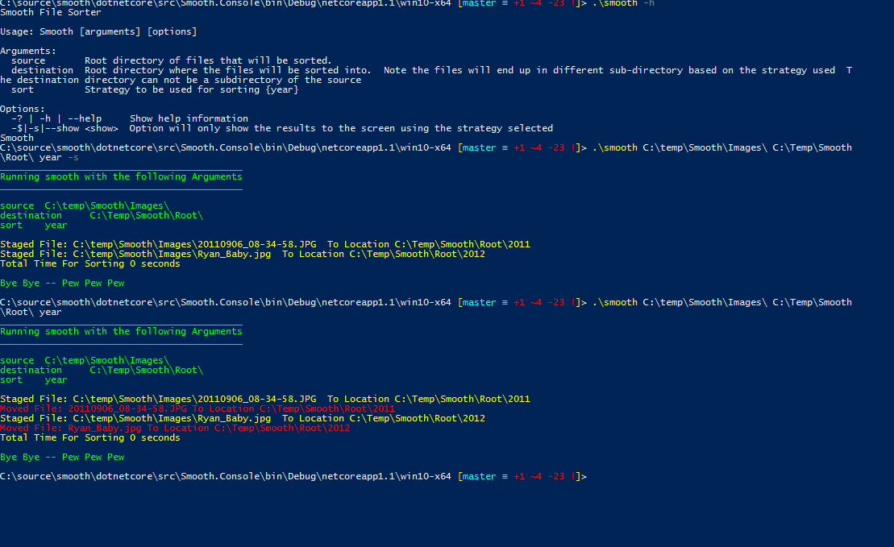

# SMOOTH

Smooth is a tool that will sort files based on the strategy picked.
The goal behind Smooth is to learn stuff, compare strengths and weaknesses of multiple programming languages.

Also I have not found a real simple image sorting utility that just works.  I am creating utility that will quickly move images off of cameras, phones and other drives how I want it while learning.

## Install

Coming soon

### Usage Example

smooth I:\\DCIM\\100D5000\\ 'G:\\My Pictures\\' year

#### help

smooth -h

#### Stage option run through it and output the results without moving files

smooth I:\\DCIM\\100D5000\\ 'G:\\My Pictures\\' -s

### Example

